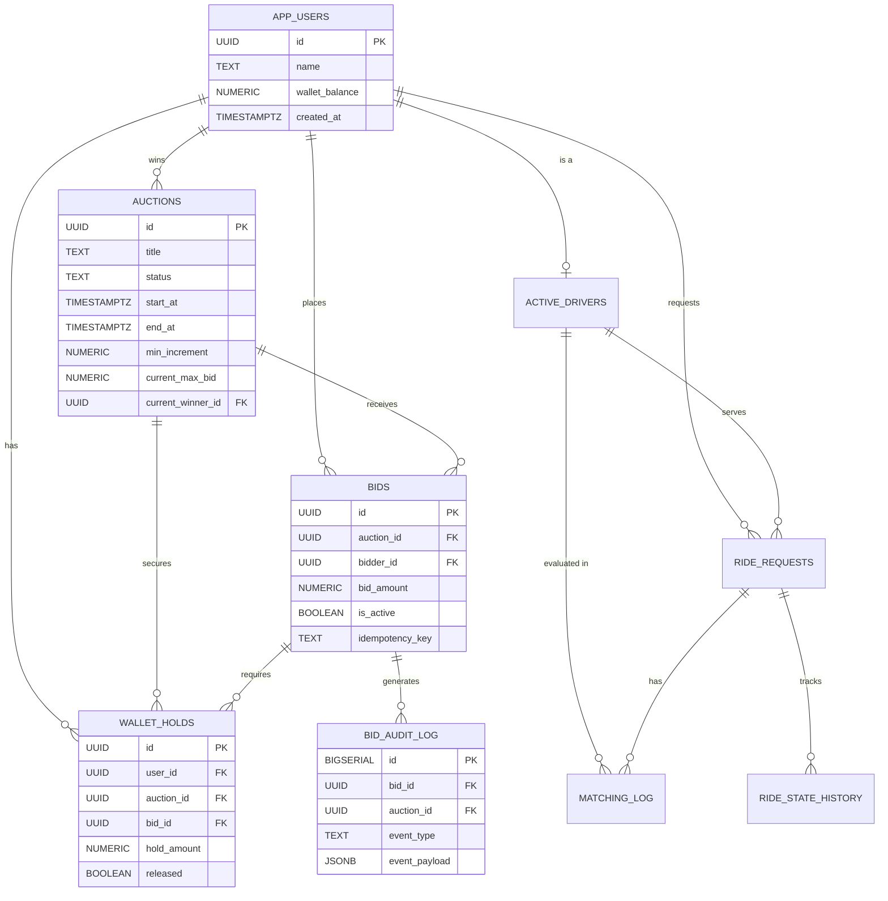

# BidLock: Real-Time Bidding & Request Dispatch Engine

A high-performance DBMS project focused on transaction integrity, concurrency, and real-time architecture using a "Thick Database, Thin API" philosophy.

## About The Project

BidLock is an advanced backend engine handling two major systems: a real-time auction bidding platform, and a geospatial ride dispatcher.

In modern applications, managing complex financial states and preventing race-conditions at the API level often leads to latency and double-spend bugs. BidLock solves this by delegating **all** critical financial computations, spatial queries, and concurrency controls directly to the PostgreSQL database layer. 

By utilizing robust database features like `FOR UPDATE SKIP LOCKED`, complex trigger constraints, and strict `SERIALIZABLE` transaction bounds, the database natively guarantees that:
- Wallet balances never drop below zero.
- Submitted bids are never duplicated or overwritten unfairly.
- Thousands of concurrent riders and drivers can be matched with microsecond latency without race conditions.

The Node.js Express server acts as a lightweight conduit, simply streaming these database-triggered state changes directly to the React/HTML frontend via Redis pub-sub caching and WebSockets.

## Architecture (ER Diagram)



## Tech Stack

- **API Layer**: Node.js v20+, TypeScript, Express.js
- **Database**: PostgreSQL 16
- **Spatial Expansion**: PostGIS (for fast proximity calculation)
- **High Concurrency**: Redis & Socket.io for immediate real-time browser updates.

## Technical Requirements
- Node.js
- Docker Desktop (Using docker-compose configures Postgres + Redis natively).

## Quick Start
1. Ensure Docker Desktop is up and running.
2. Initialize environment variables (copy `.env.example` -> `.env`).
3. Start the primary services:
   ```bash
   docker-compose up -d
   ```
4. Install node dependencies and trigger the built-in database setup/seed script:
   ```bash
   npm install
   npm run db:setup
   ```
5. Start the web server:
   ```bash
   npm run dev
   ```
6. Open your browser directly to `http://localhost:3000/` to view the Live Socket interface!

## Automated Demonstrations

Because this is a server architecture project designed to withstand massive parallel loads, we package scripts to simulate heavy network use. With the `npm run dev` server active in one terminal, run these scripts in another terminal while watching your browser `http://localhost:3000/` automatically populate in real-time.

- `npm run demo:bid-race` - Spams the auction server simultaneously with identical IDs to force Postgres into a Concurrency lock, proving only 1 bidder accurately walks away without overriding table data.
- `npm run demo:driver-herd` - Tests PostGIS `GEOMETRY` features to match the nearest GPS lat-long coordinates to a driver requesting a ride with `SKIP LOCKED` protection.
